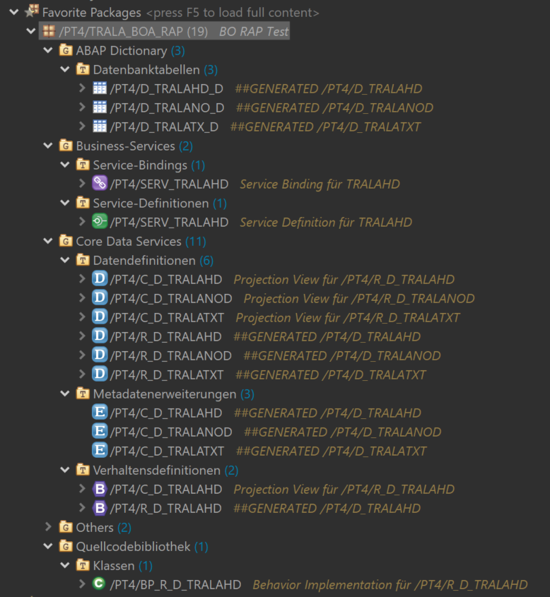

# ABAP Structure

course (https://learning.sap.com/learning-journeys/acquire-core-abap-skills)     



- Dictionary - Datenbanktabellen 
    - DB tables
    - Open with > Data preview

- Service Binding (Fiori preview)
- Service Definition (exposed views)

- CDS    
    - Datendefinitionen - view definitions
    - R_D - select from DB table (everything only once)
    - C_D - projection on R_D (whatever you neeed for specific purposes, can be multiple)

- Metadaten Erweiterungen - views for annotations/Frontend
- Verhaltensdefinitionen - behaviours
    - CRUDs
    - Validation & Determination
    - Actions

- Quellcodebibliothek
    - Classes
    - Global class > local types - Methods and their definitions

# CDS Annotations

course (https://developers.sap.com/group.fiori-tools-odata-v4-travel.html) <br />     

course (https://learning.sap.com/learning-journeys/getting-started-with-creating-an-sap-fiori-elements-app-based-on-an-odata-v4-rap-service)
     
```abap
@Search.searchable: true    
@Metadata.layer: #CORE    
@ObjectModel.semanticKey: [ 'TravelID' ]                        " hightlighted column     
    

@UI: {
    headerInfo: {
        typeNamePlural: 'Travels',                              " list
        typeName: 'Travel',                                     " object page
        title: { type: #STANDARD, value: 'Description'},        " object page Title
        description: { type: #STANDARD, value: 'TravelID'}      " object page Description
    },
    presentationVariant: [{
        sortOrder: [{
            by: 'LocalLastChangedAt',                           " sort table by
            direction: #DESC
        }],
        visualizations: [{
            type: #AS_LINEITEM                                  " ?
        }]
    }]
}
```

### List

```abap
@EndUserText.label: 'Agency'                        " Heading of the column     
@UI.textArrangement: #TEXT_ONLY                     " Display only text    
@UI.lineItem: [{position: 20}]                      " Add field to the column    

@UI.lineItem: [{position: 80, criticality: 'OverallStatusCriticality'}] 
                                                    " Colored label (1/2/3)   

"Definition:   

  case overall_status
    when 'O' then 2
    when 'A' then 3
    when 'X' then 1
    else 0
  end   as OverallStatusCriticality,


@ObjectModel.text.element: ['AgencyName'] 
AgencyID;                                           " Display combination [ 'AgencyName(AgencyID)' ]
```

```abap
@UI.selectionField: [{ position: 10 }]              " Search (selection) in header

@Consumption.valueHelpDefinition: [{ entity: {name: '/DMO/I_Agency', element: 'AgencyID'} }] 
                                                    " Search help

@ObjectModel.resultSet.sizeCategory: #XS            " Drop down menu for value help

@Search.defaultSearchElement: true                  " defaul Search field
@Search.fuzzinessThreshold: 0.90                    " how precise search result set is
```

```abap
@UI.facet: []                                       " object page sections

" Object page header section
    {
        purpose: #HEADER,
        position: 10/20/30...
        type: #DATAPOINT_REFERENCE,
        targetQualifier: 'PriceData'/'StatusData'/qualifier...
    }
    @UI.dataPoint: { qualifier: 'PriceData', title: 'Total Price'}
    TotalPrice;


" Oject page section (collection)
    {
        label: 'General Information',           " Section name
        type: #COLLECTION,
        id: 'GeneralInfo',
        position: 10
    },
    {
        label: 'General',                       " Subsection name
        type: #IDENTIFICATION_REFERENCE,        " type
        parentId: 'GeneralInfo'
    }
    @UI.identification: [{ position: 10 }]


" Object page section > subsection
    {
        label: 'Prices',                        " Subsection name
        purpose: #STANDARD,
        position: 20,
        type: #FIELDGROUP_REFERENCE,            " type
        parentId: 'GeneralInfo',
        targetQualifier: 'PricesGroup'
    }
    @UI.fieldGroup: [{ qualifier: 'PricesGroup', position: 20 }]

" Object page > table (list)
    {
        id: 'Booking',
        purpose: #STANDARD,
        type: #LINEITEM_REFERENCE,
        label: 'Bookings',
        position: 20,
        targetElement: '_Booking'
    }
```

# XML Annotations

course (https://learning.sap.com/courses/developing-and-extending-sap-fiori-elements-apps?url_id=text-former-openSAP-course)  

git (https://github.com/SAP-samples/fiori-elements-opensap/tree/main)

## Charts

### Column Chart

```xml
            <Annotations Target="cds_zfe_booking_analytics_001012.BookingType">
                <Annotation Term="UI.Chart" Qualifier="ColumnChartFlightPriceByCarrier">
                    <Record Type="UI.ChartDefinitionType">
                        <PropertyValue Property="Description" String="{@i18n>bookingFlightpriceByCarrierid}"/>
                        <PropertyValue Property="Title" String="{@i18n>bookingFlightpriceByCarrierid}"/>
                        <PropertyValue Property="ChartType" EnumMember="UI.ChartType/Column"/>
                        <PropertyValue Property="Dimensions">   (x)
                            <Collection>
                                <PropertyPath>CarrierID</PropertyPath>
                            </Collection>
                        </PropertyValue>
                        <PropertyValue Property="DimensionAttributes">
                            <Collection>
                                <Record Type="UI.ChartDimensionAttributeType">
                                    <PropertyValue Property="Dimension" PropertyPath="CarrierID"/>
                                    <PropertyValue Property="Role" EnumMember="UI.ChartDimensionRoleType/Category"/>
                                </Record>
                            </Collection>
                        </PropertyValue>
                        <PropertyValue Property="Measures">     (y)
                            <Collection>
                                <PropertyPath>FlightPrice</PropertyPath>
                            </Collection>
                        </PropertyValue>
                        <PropertyValue Property="MeasureAttributes">
                            <Collection>
                                <Record Type="UI.ChartMeasureAttributeType">
                                    <PropertyValue Property="Measure" PropertyPath="FlightPrice"/>
                                    <PropertyValue Property="Role" EnumMember="UI.ChartMeasureRoleType/Axis1"/>
                                </Record>
                            </Collection>
                        </PropertyValue>
                    </Record>
                </Annotation>

                <Annotation Term="UI.PresentationVariant">
                    <Record Type="UI.PresentationVariantType">
                        <PropertyValue Property="Text" String="Default"/>
                        <PropertyValue Property="SortOrder">
                            <Collection>
                                <Record Type="Common.SortOrderType">
                                    <PropertyValue Property="Property" PropertyPath="FlightPrice"/>
                                    <PropertyValue Property="Descending" Bool="false"/>
                                </Record>
                            </Collection>
                        </PropertyValue>
                        <PropertyValue Property="IncludeGrandTotal" Bool="false"/>
                        <PropertyValue Property="InitialExpansionLevel" Int="0"/>
                        <PropertyValue Property="Visualizations">
                            <Collection>
                                <AnnotationPath>@UI.LineItem</AnnotationPath>
                                <AnnotationPath>@UI.Chart#ColumnChartFlightPriceByCarrier</AnnotationPath>
                            </Collection>
                        </PropertyValue>
                    </Record>
                </Annotation>
            </Annotations>
```

### Line Chart

```xml

                <Annotation Term="UI.Chart" Qualifier="LineChart">
                    <Record Type="UI.ChartDefinitionType">
                        <PropertyValue Property="ChartType" EnumMember="UI.ChartType/Line"/>
                        <PropertyValue Property="Title" String="{@i18n>flightpriceByBookingdateyear}"/>
                        <PropertyValue Property="Description" String="{@i18n>flightpriceByBookingdateyear}"/>
                        <PropertyValue Property="Dimensions">
                            <Collection>
                                <PropertyPath>BookingDateYear</PropertyPath>
                            </Collection>
                        </PropertyValue>
                        <PropertyValue Property="DimensionAttributes">
                            <Collection>
                                <Record Type="UI.ChartDimensionAttributeType">
                                    <PropertyValue Property="Dimension" PropertyPath="BookingDateYear"/>
                                    <PropertyValue Property="Role" EnumMember="UI.ChartDimensionRoleType/Category"/>
                                </Record>
                            </Collection>
                        </PropertyValue>
                        <PropertyValue Property="Measures">
                            <Collection>
                                <PropertyPath>FlightPrice</PropertyPath>
                            </Collection>
                        </PropertyValue>
                        <PropertyValue Property="MeasureAttributes">
                            <Collection>
                                <Record Type="UI.ChartMeasureAttributeType">
                                    <PropertyValue Property="Measure" PropertyPath="FlightPrice"/>
                                    <PropertyValue Property="Role" EnumMember="UI.ChartMeasureRoleType/Axis1"/>
                                </Record>
                            </Collection>
                        </PropertyValue>
                    </Record>
                </Annotation>
                <Annotation Term="UI.PresentationVariant" Qualifier="PVFlightPriceBookingDateYear">
                    <Record Type="UI.PresentationVariantType">
                        <PropertyValue Property="Visualizations">
                            <Collection>
                                <AnnotationPath>@UI.Chart#LineChart</AnnotationPath>
                            </Collection>
                        </PropertyValue>
                    </Record>
                </Annotation>

            <Annotations Target="cds_zfe_booking_analytics_001012.BookingType/BookingDateYear">
                <Annotation Term="Common.ValueList" Qualifier="PVFlightPriceBookingDateYearValueList">
                    <Record Type="Common.ValueListType">
                        <PropertyValue Property="CollectionPath" String="Booking"/>
                        <PropertyValue Property="PresentationVariantQualifier" String="PVFlightPriceBookingDateYear"/>
                        <PropertyValue Property="Parameters">
                            <Collection>
                                <Record Type="Common.ValueListParameterInOut">
                                    <PropertyValue Property="LocalDataProperty" PropertyPath="BookingDateYear"/>
                                    <PropertyValue Property="ValueListProperty" String="BookingDateYear"/>
                                </Record>
                            </Collection>
                        </PropertyValue>
                    </Record>
                </Annotation>
            </Annotations>
```

### Bar Chart

```xml
                <Annotation Term="UI.Chart" Qualifier="BarChartAgencyID">
                    <Record Type="UI.ChartDefinitionType">
                        <PropertyValue Property="ChartType" EnumMember="UI.ChartType/Bar"/>
                        <PropertyValue Property="Title" String="{@i18n>flightPriceByAgencyid}"/>
                        <PropertyValue Property="Description" String="{@i18n>flightPriceByAgencyid1}"/>
                        <PropertyValue Property="Dimensions">
                            <Collection>
                                <PropertyPath>AgencyID</PropertyPath>
                            </Collection>
                        </PropertyValue>
                        <PropertyValue Property="DimensionAttributes">
                            <Collection>
                                <Record Type="UI.ChartDimensionAttributeType">
                                    <PropertyValue Property="Dimension" PropertyPath="AgencyID"/>
                                    <PropertyValue Property="Role" EnumMember="UI.ChartDimensionRoleType/Category"/>
                                </Record>
                            </Collection>
                        </PropertyValue>
                        <PropertyValue Property="Measures">
                            <Collection>
                                <PropertyPath>FlightPrice</PropertyPath>
                            </Collection>
                        </PropertyValue>
                        <PropertyValue Property="MeasureAttributes">
                            <Collection>
                                <Record Type="UI.ChartMeasureAttributeType">
                                    <PropertyValue Property="Measure" PropertyPath="FlightPrice"/>
                                    <PropertyValue Property="Role" EnumMember="UI.ChartMeasureRoleType/Axis1"/>
                                </Record>
                            </Collection>
                        </PropertyValue>
                    </Record>
                </Annotation>
                <Annotation Term="UI.PresentationVariant" Qualifier="PVFlightPriceAgencyID">
                    <Record Type="UI.PresentationVariantType">
                        <PropertyValue Property="Visualizations">
                            <Collection>
                                <AnnotationPath>@UI.Chart#BarChartAgencyID</AnnotationPath>
                            </Collection>
                        </PropertyValue>
                    </Record>
                </Annotation>

            <Annotations Target="cds_zfe_booking_analytics_001012.BookingType/AgencyID">
                <Annotation Term="Common.ValueList" Qualifier="PVFlightPriceAgencyIDValueList">
                    <Record Type="Common.ValueListType">
                        <PropertyValue Property="CollectionPath" String="Booking"/>
                        <PropertyValue Property="PresentationVariantQualifier" String="PVFlightPriceAgencyID"/>
                        <PropertyValue Property="Parameters">
                            <Collection>
                                <Record Type="Common.ValueListParameterInOut">
                                    <PropertyValue Property="LocalDataProperty" PropertyPath="AgencyID"/>
                                    <PropertyValue Property="ValueListProperty" String="AgencyID"/>
                                </Record>
                            </Collection>
                        </PropertyValue>
                    </Record>
                </Annotation>
            </Annotations>

```

### Pie Chart

```xml
                <Annotation Term="UI.Chart" Qualifier="PieChart">
                    <Record Type="UI.ChartDefinitionType">
                        <PropertyValue Property="ChartType" EnumMember="UI.ChartType/Donut"/>
                        <PropertyValue Property="Title" String="{@i18n>flightPriceByCustomer}"/>
                        <PropertyValue Property="Description" String="{@i18n>flightPriceByCustomer}"/>
                        <PropertyValue Property="Dimensions">
                            <Collection>
                                <PropertyPath>CustomerID</PropertyPath>
                            </Collection>
                        </PropertyValue>
                        <PropertyValue Property="DimensionAttributes">
                            <Collection>
                                <Record Type="UI.ChartDimensionAttributeType">
                                    <PropertyValue Property="Dimension" PropertyPath="CustomerID"/>
                                    <PropertyValue Property="Role" EnumMember="UI.ChartDimensionRoleType/Category"/>
                                </Record>
                            </Collection>
                        </PropertyValue>
                        <PropertyValue Property="Measures">
                            <Collection>
                                <PropertyPath>FlightPrice</PropertyPath>
                            </Collection>
                        </PropertyValue>
                        <PropertyValue Property="MeasureAttributes">
                            <Collection>
                                <Record Type="UI.ChartMeasureAttributeType">
                                    <PropertyValue Property="Measure" PropertyPath="FlightPrice"/>
                                    <PropertyValue Property="Role" EnumMember="UI.ChartMeasureRoleType/Axis1"/>
                                </Record>
                            </Collection>
                        </PropertyValue>
                    </Record>
                </Annotation>
                <Annotation Term="UI.PresentationVariant" Qualifier="PVFlightPriceCustomerID">
                    <Record Type="UI.PresentationVariantType">
                        <PropertyValue Property="Visualizations">
                            <Collection>
                                <AnnotationPath>@UI.Chart#PieChart</AnnotationPath>
                            </Collection>
                        </PropertyValue>
                    </Record>
                </Annotation>

            <Annotations Target="cds_zfe_booking_analytics_001012.BookingType/CustomerID">
                <Annotation Term="Common.ValueList" Qualifier="PVFlightPriceCustomerIDValueList">
                    <Record Type="Common.ValueListType">
                        <PropertyValue Property="CollectionPath" String="Booking"/>
                        <PropertyValue Property="PresentationVariantQualifier" String="PVFlightPriceCustomerID"/>
                        <PropertyValue Property="Parameters">
                            <Collection>
                                <Record Type="Common.ValueListParameterInOut">
                                    <PropertyValue Property="LocalDataProperty" PropertyPath="CustomerID"/>
                                    <PropertyValue Property="ValueListProperty" String="CustomerID"/>
                                </Record>
                            </Collection>
                        </PropertyValue>
                    </Record>
                </Annotation>
            </Annotations>
```

## Cards

```json
        "globalFilterModel": "mainModel",
        "globalFilterEntityType": "BookingType",
        "containerLayout": "resizable",
        "enableLiveFilter": true,
        "considerAnalyticalParameters": false,
        "cards": {}
```
```xml

        <Annotation Term="UI.Identification" Qualifier="ToBookingAnalysis">
            <Collection>
                <Record Type="UI.DataFieldForIntentBasedNavigation">
                    <PropertyValue Property="SemanticObject" String="Booking"/>
                    <PropertyValue Property="Action" String="analysis"/>
                </Record>
            </Collection>
        </Annotation>
```

manifest.json + annotations

```json
            "CARD_000": {
              "template": "sap.ovp.cards.charts.analytical",
              "model": "mainModel",
              "settings": {
                "chartAnnotationPath": "com.sap.vocabularies.UI.v1.Chart#FlightPriceColumn",
                "valueSelectionInfo": "Total Spending On Flights",
                "entitySet": "Booking",
                "title": "{i18n>spendingOnFlights}",
                "identificationAnnotationPath": "com.sap.vocabularies.UI.v1.Identification#ToBookingAnalysis",
                "dataPointAnnotationPath": "com.sap.vocabularies.UI.v1.DataPoint#FlightPriceColumnDataPoint"
              }
            }
```
```xml
                        
                <Annotation Term="UI.Chart" Qualifier="FlightPriceColumn">
                    <Record Type="UI.ChartDefinitionType">
                        <PropertyValue Property="ChartType" EnumMember="UI.ChartType/Column"/>
                        <PropertyValue Property="Title" String="{@i18n>dailyFlightCost}"/>
                        <PropertyValue Property="Description" String="{@i18n>dailyFlightCost}"/>
                        <PropertyValue Property="Dimensions">
                            <Collection>
                                <PropertyPath>FlightDate</PropertyPath>
                            </Collection>
                        </PropertyValue>
                        <PropertyValue Property="DimensionAttributes">
                            <Collection>
                                <Record Type="UI.ChartDimensionAttributeType">
                                    <PropertyValue Property="Dimension" PropertyPath="FlightDate"/>
                                    <PropertyValue Property="Role" EnumMember="UI.ChartDimensionRoleType/Category"/>
                                </Record>
                            </Collection>
                        </PropertyValue>
                        <PropertyValue Property="Measures">
                            <Collection>
                                <PropertyPath>FlightPrice</PropertyPath>
                            </Collection>
                        </PropertyValue>
                        <PropertyValue Property="MeasureAttributes">
                            <Collection>
                                <Record Type="UI.ChartMeasureAttributeType">
                                    <PropertyValue Property="Measure" PropertyPath="FlightPrice"/>
                                    <PropertyValue Property="Role" EnumMember="UI.ChartMeasureRoleType/Axis1"/>
                                </Record>
                            </Collection>
                        </PropertyValue>
                    </Record>
                </Annotation>
                <Annotation Term="UI.DataPoint" Qualifier="FlightPriceColumnDataPoint">
                    <Record Type="UI.DataPointType">
                        <PropertyValue Property="Value" Path="FlightPrice"/>
                        <PropertyValue Property="Title" String="{@i18n>flightprice}"/>
                    </Record>
                </Annotation>
```
```json

            "CARD_001": {
              "template": "sap.ovp.cards.v4.table",
              "model": "zui_fe_travel_001012_o4",
              "settings": {
                "entitySet": "Travel",
                "title": "{i18n>travelList}",
                "tabs": [
                  {
                    "annotationPath": "com.sap.vocabularies.UI.v1.LineItem#OpenInprogressTravels",
                    "selectionAnnotationPath": "com.sap.vocabularies.UI.v1.SelectionVariant#OpenInProgressSelection",
                    "identificationAnnotationPath": "com.sap.vocabularies.UI.v1.Identification#ToTravelManage",
                    "value": "Open/In Progress"
                  },
                  {
                    "annotationPath": "com.sap.vocabularies.UI.v1.LineItem#AcceptedTravels",
                    "selectionAnnotationPath": "com.sap.vocabularies.UI.v1.SelectionVariant#AcceptedSelection",
                    "identificationAnnotationPath": "com.sap.vocabularies.UI.v1.Identification#ToTravelManage",
                    "value": "Accepted"
                  },
                  {
                    "annotationPath": "com.sap.vocabularies.UI.v1.LineItem#RejectedTravels",
                    "selectionAnnotationPath": "com.sap.vocabularies.UI.v1.SelectionVariant#RejectedSelection",
                    "identificationAnnotationPath": "com.sap.vocabularies.UI.v1.Identification#ToTravelManage",
                    "value": "Rejected"
                  }
                ],
                "sortBy": "BeginDate",
                "sortOrder": "ascending"
              }
            }
```
```xml
                        <Annotations Target="com.sap.gateway.srvd.zfe_travel_001012.v0001.TravelType">
                <Annotation Term="UI.DataPoint" Qualifier="TravelBeginDateOpenInProgress">
                    <Record Type="UI.DataPointType">
                        <PropertyValue Property="Criticality" EnumMember="UI.CriticalityType/Critical"/>
                        <PropertyValue Property="Value" Path="BeginDate"/>
                        <PropertyValue Property="Title" String="{@i18n>openinProgressTravels}"/>
                    </Record>
                </Annotation>
                <Annotation Term="UI.DataPoint" Qualifier="TravelBeginDateAccepted">
                    <Record Type="UI.DataPointType">
                        <PropertyValue Property="Criticality" EnumMember="UI.CriticalityType/Positive"/>
                        <PropertyValue Property="Value" Path="BeginDate"/>
                        <PropertyValue Property="Title" String="{@i18n>acceptedTravels}"/>
                    </Record>
                </Annotation>
                <Annotation Term="UI.DataPoint" Qualifier="TravelBeginDateRejected">
                    <Record Type="UI.DataPointType">
                        <PropertyValue Property="Criticality" EnumMember="UI.CriticalityType/Negative"/>
                        <PropertyValue Property="Value" Path="BeginDate"/>
                        <PropertyValue Property="Title" String="{@i18n>rejectedTravels}"/>
                    </Record>
                </Annotation>
                <Annotation Term="UI.LineItem" Qualifier="OpenInprogressTravels">
                    <Collection>
                        <Record Type="UI.DataField">
                            <PropertyValue Property="Value" Path="Description"/>
                            <PropertyValue Property="Label" String="{@i18n>travel}"/>
                        </Record>
                        <Record Type="UI.DataField">
                            <PropertyValue Property="Value" Path="LastName" />
                            <PropertyValue Property="Label" String="{@i18n>customer}" />
                        </Record>
                        <Record Type="UI.DataFieldForAnnotation">
                            <PropertyValue Property="Target" AnnotationPath="@UI.DataPoint#TravelBeginDateOpenInProgress" />
                        </Record>
                    </Collection>
                </Annotation>
                <Annotation Term="UI.LineItem" Qualifier="AcceptedTravels">
                    <Collection>
                        <Record Type="UI.DataField">
                            <PropertyValue Property="Label" String="{@i18n>travel}" />
                            <PropertyValue Property="Value" Path="Description" />
                        </Record>
                        <Record Type="UI.DataField">
                            <PropertyValue Property="Value" Path="LastName" />
                            <PropertyValue Property="Label" String="{@i18n>customer}" />
                        </Record>
                        <Record Type="UI.DataFieldForAnnotation">
                            <PropertyValue Property="Target" AnnotationPath="@UI.DataPoint#TravelBeginDateAccepted" />
                        </Record>
                    </Collection>
                </Annotation>
                <Annotation Term="UI.LineItem" Qualifier="RejectedTravels">
                    <Collection>
                        <Record Type="UI.DataField">
                            <PropertyValue Property="Label" String="{@i18n>travel}" />
                            <PropertyValue Property="Value" Path="Description" />
                        </Record>
                        <Record Type="UI.DataField">
                            <PropertyValue Property="Value" Path="LastName" />
                            <PropertyValue Property="Label" String="{@i18n>customer}" />
                        </Record>
                        <Record Type="UI.DataFieldForAnnotation">
                            <PropertyValue Property="Target" AnnotationPath="@UI.DataPoint#TravelBeginDateRejected" />
                        </Record>
                    </Collection>
                </Annotation>
                <Annotation Term="UI.SelectionVariant" Qualifier="OpenInProgressSelection">
                    <Record>
                        <PropertyValue Property="SelectOptions">
                            <Collection>
                                <Record Type="UI.SelectOptionType">
                                    <PropertyValue Property="PropertyName" PropertyPath="StatusText"/>
                                    <PropertyValue Property="Ranges">
                                        <Collection>
                                            <Record Type="UI.SelectionRangeType">
                                                <PropertyValue Property="Sign" EnumMember="UI.SelectionRangeSignType/I"/>
                                                <PropertyValue Property="Option" EnumMember="UI.SelectionRangeOptionType/EQ"/>
                                                <PropertyValue Property="Low" String="Open"/>
                                            </Record>
                                        </Collection>
                                    </PropertyValue>
                                </Record>
                                <Record Type="UI.SelectOptionType">
                                    <PropertyValue Property="PropertyName" PropertyPath="StatusText" />
                                    <PropertyValue Property="Ranges">
                                        <Collection>
                                            <Record>
                                                <PropertyValue Property="Sign" EnumMember="UI.SelectionRangeSignType/I" />
                                                <PropertyValue Property="Option" EnumMember="UI.SelectionRangeOptionType/EQ" />
                                                <PropertyValue Property="Low" String="In Progress" />
                                            </Record>
                                        </Collection>
                                    </PropertyValue>
                                </Record>
                            </Collection>
                        </PropertyValue>
                    </Record>
                </Annotation>
                <Annotation Term="UI.SelectionVariant" Qualifier="AcceptedSelection">
                    <Record>
                        <PropertyValue Property="SelectOptions">
                            <Collection>
                                <Record>
                                    <PropertyValue Property="PropertyName" PropertyPath="StatusText" />
                                    <PropertyValue Property="Ranges">
                                        <Collection>
                                            <Record>
                                                <PropertyValue Property="Sign" EnumMember="UI.SelectionRangeSignType/I" />
                                                <PropertyValue Property="Option" EnumMember="UI.SelectionRangeOptionType/EQ" />
                                                <PropertyValue Property="Low" String="Accepted" />
                                            </Record>
                                        </Collection>
                                    </PropertyValue>
                                </Record>
                            </Collection>
                        </PropertyValue>
                    </Record>
                </Annotation>
                <Annotation Term="UI.SelectionVariant" Qualifier="RejectedSelection">
                    <Record>
                        <PropertyValue Property="SelectOptions">
                            <Collection>
                                <Record>
                                    <PropertyValue Property="PropertyName" PropertyPath="StatusText" />
                                    <PropertyValue Property="Ranges">
                                        <Collection>
                                            <Record>
                                                <PropertyValue Property="Sign" EnumMember="UI.SelectionRangeSignType/I" />
                                                <PropertyValue Property="Option" EnumMember="UI.SelectionRangeOptionType/EQ" />
                                                <PropertyValue Property="Low" String="Rejected" />
                                            </Record>
                                        </Collection>
                                    </PropertyValue>
                                </Record>
                            </Collection>
                        </PropertyValue>
                    </Record>
                </Annotation>
                <Annotation Term="UI.Identification" Qualifier="ToTravelManage">
                    <Collection>
                        <Record Type="UI.DataFieldForIntentBasedNavigation">
                            <PropertyValue Property="SemanticObject" String="Travel"/>
                            <PropertyValue Property="Action" String="manage"/>
                        </Record>
                    </Collection>
                </Annotation>
            </Annotations>

```
```json

            "CARD_002": {
              "model": "mainModel",
              "template": "sap.ovp.cards.linklist",
              "settings": {
                "title": "Quick Links",
                "listFlavor": "standard",
                "staticContent": [
                  {
                    "title": "Create Travel",
                    "imageUri": "sap-icon://create",
                    "imageAltText": "{{card30_icon_so_man}}",
                    "targetUri": "https://sap.com",
                    "openInNewWindow": true
                  },
                  {
                    "title": "Manage Travel",
                    "imageUri": "sap-icon://edit",
                    "imageAltText": "{{card30_icon_so_man}}",
                    "targetUri": "https://sap.com",
                    "openInNewWindow": true
                  },
                  {
                    "title": "Airport Status",
                    "imageUri": "sap-icon://message-information",
                    "imageAltText": "{{card30_icon_so_man}}",
                    "targetUri": "https://sap.com",
                    "openInNewWindow": true
                  },
                  {
                    "title": "Location Guides",
                    "imageUri": "sap-icon://functional-location",
                    "imageAltText": "{{card30_icon_so_man}}",
                    "targetUri": "https://sap.com",
                    "openInNewWindow": true
                  },
                  {
                    "title": "Travel Warnings",
                    "imageUri": "sap-icon://alert",
                    "imageAltText": "{{card30_icon_so_man}}",
                    "targetUri": "https://sap.com",
                    "openInNewWindow": true
                  },
                  {
                    "title": "Rental Car Booking",
                    "imageUri": "sap-icon://car-rental",
                    "imageAltText": "{{card30_icon_so_man}}",
                    "targetUri": "https://sap.com",
                    "openInNewWindow": true
                  }
                ]
              }
            }
            json only
```

```json

            "CARD_003": {
              "model": "mainModel",
              "template": "sap.ovp.cards.charts.analytical",
              "settings": {
                "title": "Spending By Airlines",
                "entitySet": "Booking",
                "identificationAnnotationPath": "com.sap.vocabularies.UI.v1.Identification#ToBookingAnalysis",
                "chartAnnotationPath": "com.sap.vocabularies.UI.v1.Chart#FlightPriceByAirlineDonut"
              }
            }

```
```xml

                <Annotation Term="UI.Chart" Qualifier="FlightPriceByAirlineDonut">
                    <Record Type="UI.ChartDefinitionType">
                        <PropertyValue Property="Title" String="{@i18n>flightCostByAirlines}"/>
                        <PropertyValue Property="MeasureAttributes">
                            <Collection>
                                <Record Type="UI.ChartMeasureAttributeType">
                                    <PropertyValue Property="Measure" PropertyPath="FlightPrice"/>
                                    <PropertyValue Property="Role" EnumMember="UI.ChartMeasureRoleType/Axis1"/>
                                </Record>
                            </Collection>
                        </PropertyValue>
                        <PropertyValue Property="DimensionAttributes">
                            <Collection>
                                <Record Type="UI.ChartDimensionAttributeType">
                                    <PropertyValue Property="Dimension" PropertyPath="CarrierName"/>
                                    <PropertyValue Property="Role" EnumMember="UI.ChartDimensionRoleType/Category"/>
                                </Record>
                            </Collection>
                        </PropertyValue>
                        <PropertyValue Property="ChartType" EnumMember="UI.ChartType/Donut"/>
                    </Record>
                </Annotation>

```

### Useful from PageMap

i18n <br/>
Initial Load <br/>
Column layout <br/>

### Side effects (Validation + Determination)

- Method configuration on back end;

```abap
" in behaviour
{
    internal action reCalcTotalPrice;

    field ( readonly ) TotalPrice;
    determination calculateTotalPrice on modify { create; field BookingFee, CurrencyCode; }
}

"in class
  METHOD reCalcTotalPrice.

    TYPES: BEGIN OF ty_amount_per_currencycode,
            amount        TYPE /dmo/total_price,
            currency_code TYPE /dmo/currency_code,
    END OF ty_amount_per_currencycode.

    DATA: amount_per_currencycode TYPE STANDARD TABLE OF ty_amount_per_currencycode.

    " Read all relevant travel instances.
    READ ENTITIES OF ZI_FE_Travel_001249 IN LOCAL MODE
        ENTITY Travel
            FIELDS ( BookingFee CurrencyCode )
            WITH CORRESPONDING #( keys )
        RESULT DATA(travels).

    DELETE travels WHERE CurrencyCode IS INITIAL.

    LOOP AT travels ASSIGNING FIELD-SYMBOL(<travel>).
    " Set the start for the calculation by adding the booking fee.
    amount_per_currencycode = VALUE #( ( amount        = <travel>-BookingFee
                                        currency_code = <travel>-CurrencyCode ) ).

    " Read all associated bookings and add them to the total price.
    READ ENTITIES OF ZI_FE_Travel_001249 IN LOCAL MODE
        ENTITY Travel BY \_Booking
        FIELDS ( FlightPrice CurrencyCode )
        WITH VALUE #( ( %tky = <travel>-%tky ) )
        RESULT DATA(bookings).

    LOOP AT bookings INTO DATA(booking) WHERE CurrencyCode IS NOT INITIAL.
    COLLECT VALUE ty_amount_per_currencycode( amount        = booking-FlightPrice
            currency_code = booking-CurrencyCode ) INTO amount_per_currencycode.
    ENDLOOP.


    CLEAR <travel>-TotalPrice.
    LOOP AT amount_per_currencycode INTO DATA(single_amount_per_currencycode).
    " If needed do a Currency Conversion
    IF single_amount_per_currencycode-currency_code = <travel>-CurrencyCode.
        <travel>-TotalPrice += single_amount_per_currencycode-amount.
    ELSE.
        /dmo/cl_flight_amdp=>convert_currency(
            EXPORTING
            iv_amount                   =  single_amount_per_currencycode-amount
            iv_currency_code_source     =  single_amount_per_currencycode-currency_code
            iv_currency_code_target     =  <travel>-CurrencyCode
            iv_exchange_rate_date       =  cl_abap_context_info=>get_system_date( )
        IMPORTING
            ev_amount                   = DATA(total_booking_price_per_curr)
        ).
        <travel>-TotalPrice += total_booking_price_per_curr.
    ENDIF.
    ENDLOOP.
    ENDLOOP.

    " write back the modified total_price of travels
    MODIFY ENTITIES OF ZI_FE_Travel_001249 IN LOCAL MODE
    ENTITY travel
        UPDATE FIELDS ( TotalPrice )
        WITH CORRESPONDING #( travels ).
  ENDMETHOD.

  METHOD calculateTotalPrice.
      MODIFY ENTITIES OF ZI_FE_Travel_001249 IN LOCAL MODE
        ENTITY Travel
        EXECUTE reCalcTotalPrice
        FROM CORRESPONDING #( keys ).
  ENDMETHOD.


" in behaviour
  {
    determination calculateTotalPrice on modify { create; field FlightPrice, CurrencyCode; }
  }

" in class
  METHOD calculateTotalPrice.
    " Read all parent UUIDs
    READ ENTITIES OF ZI_FE_Travel_001249 IN LOCAL MODE
    ENTITY Booking BY \_Travel
        FIELDS ( TravelUUID  )
        WITH CORRESPONDING #(  keys  )
    RESULT DATA(travels).

    " Trigger Re-Calculation on Root Node
    MODIFY ENTITIES OF ZI_FE_Travel_001249 IN LOCAL MODE
    ENTITY Travel
        EXECUTE reCalcTotalPrice
        FROM CORRESPONDING  #( travels ).
  ENDMETHOD.
```
```xml
            <Annotations Target="SAP__self.TravelType">
                <Annotation Term="Common.SideEffects" Qualifier="mySideEffect1">
                    <Record Type="Common.SideEffectsType">
                        <PropertyValue Property="SourceProperties">
                            <Collection>
                                <PropertyPath>BookingFee</PropertyPath>
                            </Collection>
                        </PropertyValue>
                        <PropertyValue Property="TargetProperties">
                            <Collection>
                                <String>TotalPrice</String>
                            </Collection>
                        </PropertyValue>
                    </Record>
                </Annotation>
                <Annotation Term="Common.SideEffects" Qualifier="mySideEffect2">
                    <Record Type="Common.SideEffectsType">
                        <PropertyValue Property="TargetProperties">
                            <Collection>
                                <String>TotalPrice</String>
                            </Collection>
                        </PropertyValue>
                    </Record>
                </Annotation>
            </Annotations>
```

### Fragments

In webapp > ext > FragmentName.fragment.xml   <br />
PageMap > ObjectPage > Add custom section

```xml

<core:FragmentDefinition xmlns:core="sap.ui.core"
    xmlns="sap.m"
    xmlns:macros="sap.fe.macros"
    xmlns:vbm="sap.ui.vbm"
    displayBlock="true">

    <VBox>

    <HBox class="">
        <Text text="The bookings were confirmed on" class="sapUiTinyMarginEnd"/>
        <macros:Field readOnly="true" metaPath="CreatedAt" id="custom-flightdate"/>
        <Text text="by" class="sapUiTinyMarginBeginEnd"/>
        <macros:Field readOnly="true" metaPath="AgencyID" id="custom-airline"/>  
    </HBox>

    <vbm:AnalyticMap width="100%" xmlns:l="sap.ui.layout" height="600px" initialPosition="-47.48339103742949; 48.70365903454684;0" initialZoom="2" class="sapUiMediumMarginTop">
        <vbm:vos>
            <vbm:Routes>
                <vbm:Route position="8.682127;50.110924;0; -73.780968;40.641766;0" color="rgb(204,0,0)" colorBorder="rgb(255,255,255)" linewidth="3" routetype="Geodesic" />
                <vbm:Route position="-73.780968;40.641766;0; -122.389977;37.615223;0" color="rgb(255,128,0)" colorBorder="rgb(255,255,255)" linewidth="3" routetype="Geodesic" />
                <vbm:Route position="-122.389977;37.615223;0; 8.682127;50.110924;0" color="rgb(0,153,76)" colorBorder="rgb(255,255,255)" linewidth="3" routetype="Geodesic" />
            </vbm:Routes>
            <vbm:Spots>
                <vbm:Spot position="8.682127;50.110924;0" tooltip="Frankfurt am Main (FRA)" labelType="Default" labelText="Frankfurt am Main (FRA)" labelPos="5" />
                <vbm:Spot position="-73.780968;40.641766;0" tooltip="New York (JFK)" labelType="Default" labelText="New York (JFK)" labelPos="5" />
                <vbm:Spot position="-122.389977;37.615223;0" tooltip="San Francisco (SFO)" labelType="Default" labelText="San Francisco (SFO)" labelPos="5" />
            </vbm:Spots>
        </vbm:vos>
    </vbm:AnalyticMap>
    </VBox>
</core:FragmentDefinition>
```

### Launchpad
### Navigation
### Buttons + Action buttons